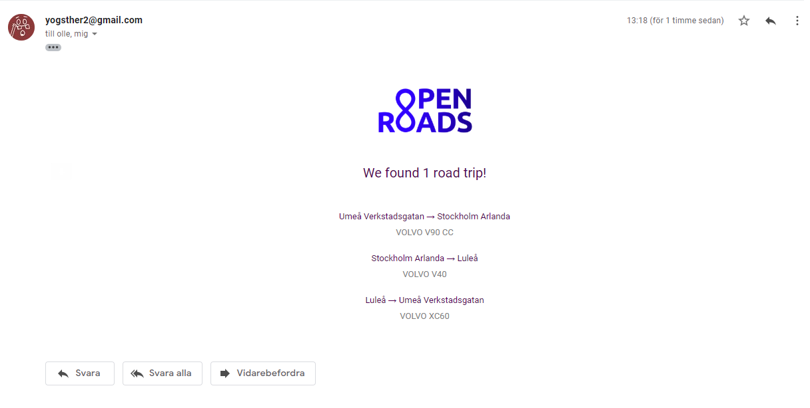

# OpenRoads

[Hertz Freerider](https://www.hertzfreerider.se/unauth/list_transport_offer.aspx) is a program that the car rental Hertz runs. It's a mutually beneficial system where drivers can for free rent a car if they need it to be moved (They even pay for the gas). They already have a system where you can get emails when there are trips from your location, but what about road trips? OpenRoads calculates whenever there are road trips available and can send you and email about it.

## Installation

1. Clone this repo
2. Install dependecies ```npm i```
3. Run it! ```node index.js```
4. (Optional) Configure ```config.json```

## Setup email
If you want to recieve emails, you have to configure the config.json with the credentials to a gmail account. 

On the sender gmail, make sure allow [less secure apps is on!](https://myaccount.google.com/lesssecureapps), this will not work if you have two factor authentication on that account.

Then fill out the clients array in the config with the emails you want to recieve the notifications about road trips!

**Note:** You have to start the program once to generate the config file!

